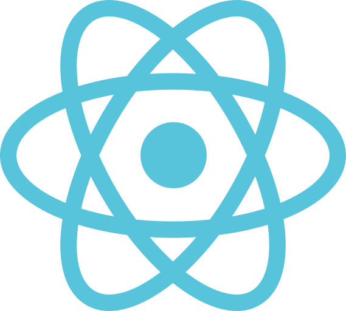
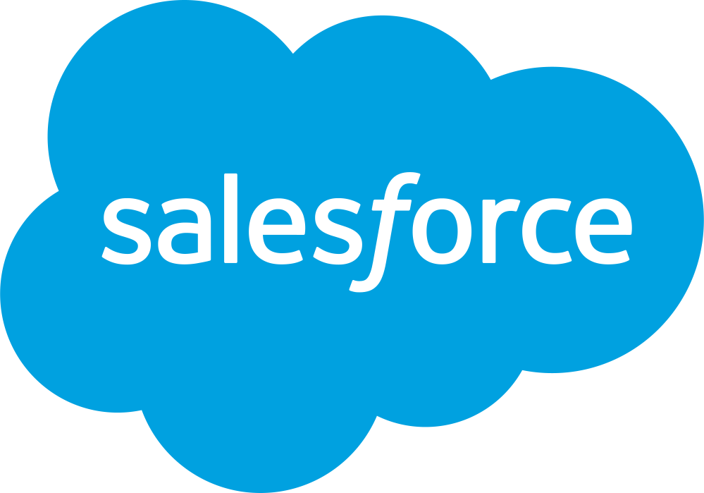

# ¡Bienvenido a mi Portfolio! 👋

Aquí encontrarás una muestra de mis proyectos, habilidades y experiencia. 🚀

## Sobre mí 🧑‍💻

Soy **Desarrollador de Software**, orientado principalmente a las Full-Stack para Webs, apasionado por crear experiencias digitales atractivas e innovadoras, desde la Web hasta de CLI, Cloud y Containers. Me encanta aprender nuevas tecnologías y aplicarlas para resolver problemas del mundo real.

**Mis áreas de interés incluyen:**

* **Desarrollo Front-End** (JavaScript, React, Tailwind, Astro)
* **Desarrollo Back-End** (Java EE, Spring Boot, Go/Golang)
* **Bases de Datos** (SQL, NoSQL)
* **Ciencia de Datos / Data Science** (Python, ML)
* **DevOps** (Docker, Linux, Bash, AWS, GCP)
* **Salesforce** (Apex, LWC, Standard Tools)

## TechSkills 🛠️

Lenguajes, frameworks, herramientas y tecnologías que domino y utilizo en mis proyectos.

    
    
    
    
    
    
    
    
    

    
    
    
    

    
    
    
    
    
    
    
    

    
    
    

## Cursos & Certificaciones 📜

**Certificaciones y cursos que he completado:**

* Salesforce Platform Developer I
* Salesforce JavaScript Developer I
* Salesforce Sharing and Visibility Architect
* AWS Academy Cloud Foundations
* Google Cloud Computing Foundations
* Microservicios con Spring Boot y Spring Cloud

## ¡Gracias por visitar mi Portfolio! 🙏

**Espero que te haya gustado.** 😊

**¡Conectemos!** ➡️ [Mi LinkedIn](https://www.linkedin.com/in/joaqu%C3%ADn-g%C3%A9nova-a4011022a/)

**¡Visita mi portfolio!** ➡️ [https://joaquingenova.dev](https://joaquingenova.dev)
